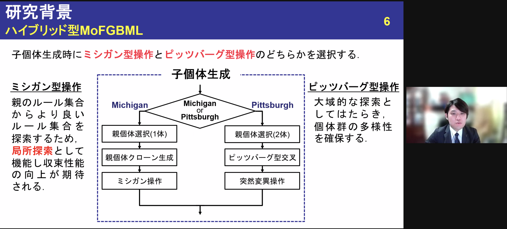

面﨑君，山田さんが9月21日から23日にオンラインで開催された[FAN2021](https://sites.google.com/view/fan2021online/)で発表を行いました.
 

 

 
=出典情報=
面﨑祐一, 増山直輝, 能島裕介, 石渕久生, "多目的ファジィ遺伝的機械学習におけるルール追加型ミシガン操作," インテリジェント・システム・シンポジウム2021, オンライン, 9月, 2021.

山田友菜, 尼子就都, 増山直輝, 能島裕介, 石渕久生, "パラメータの自動設定機構を導入した階層的トポロジカルクラスタリング," インテリジェント・システム・シンポジウム2021, オンライン, 9月, 2021.
